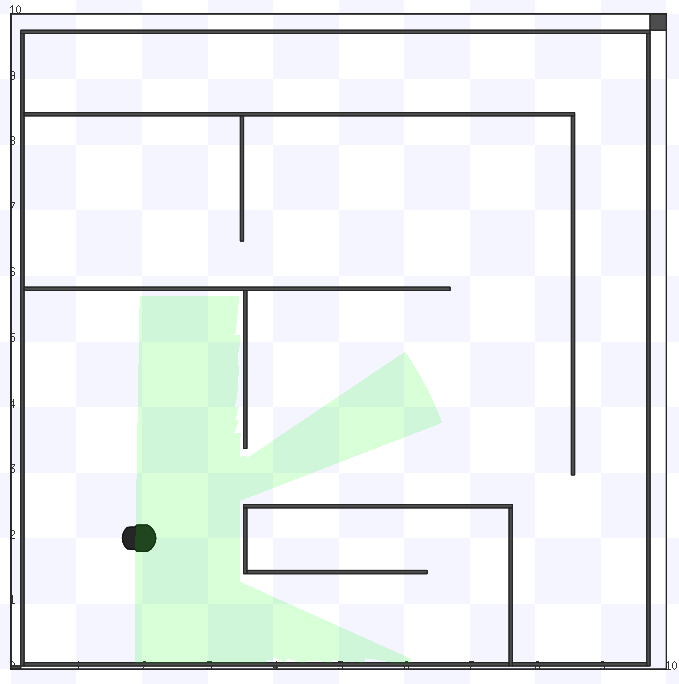
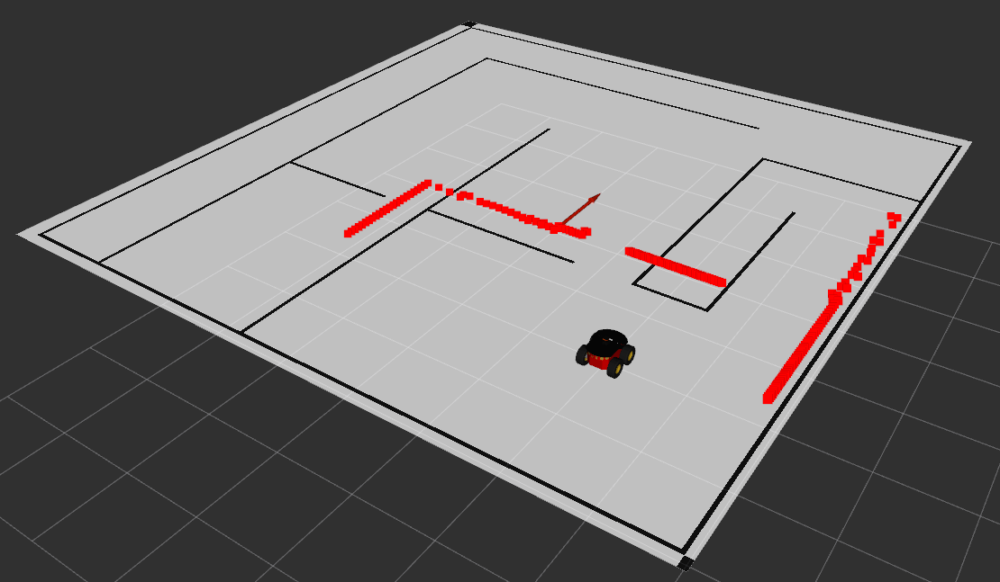

# robots_roboticamovel_2018_2
Repo with the robots used at the Mobile Robotic Class 2018-2

Stage sim             |  Rviz visualization
:-------------------------:|:-------------------------:
 <!-- .element width="200" -->  |   <!-- .element width="200" -->

### Installation

This setup was tested in ROS Kinetic, running on Ubuntu 16.04 LTS.

Download from github and install the dependencies:

```sh
# Download the repo files to your ROS Catkin Workspace
$ cd ~/catkin_ws/src/
$ git clone https://github.com/h3ct0r/robots_roboticamovel_2018_2

# Use rosdep to install the package dependences 
$ cd ~/catkin_ws/
$ rosdep install --from-paths src/robots_roboticamovel_2018_2 --ignore-src -r -y

# Update information into your ROS Workspace
$ catkin_make
$ source devel/setup.bash
```

### Running the nodes

1.Choose one of the several options to run the [Stage Simulator](http://wiki.ros.org/stage ):

- To use a differencial robot (Pioneer DX):
```sh
# Empty map
$ roslaunch robots_roboticamovel_2018_2 empty_differential.launch

# Simple obstacles map
$ roslaunch robots_roboticamovel_2018_2 simple_differential.launch
```
- To use a holonomic robot (Turtlebot):
```sh
# Empty map
$ roslaunch robots_roboticamovel_2018_2 empty_holonomic.launch

# Simple obstacles map
$ roslaunch robots_roboticamovel_2018_2 simple_holonomic.launch
```


2.After the robot and the simulation have been started:
   - Create the map server:
```bash
# If using the empy map
$ rosrun map_server map_server `rospack find robots_roboticamovel_2018_2`/stage_models/bitmaps/empty.yaml
# if using simple map
$ rosrun map_server map_server `rospack find robots_roboticamovel_2018_2`/stage_models/bitmaps/cave.yaml
```
   - The ft (transformations) between the map and the odometer information:
```bash
$ rosrun tf static_transform_publisher -8 -8 0 0 0 0 1 /odom /map 10
```
   - Visuzalize the robot odometry and the laser scan:
```bash
$ rosrun rviz rviz -d 'rospack find robots_roboticamovel_2018_2' /rviz/simple_robot.rviz
```

3.Running the teleop node to control the robot with the keyboard:
```sh
$ rosrun teleop_twist_keyboard teleop_twist_keyboard.py cmd_vel:=/cmd_vel
```

### Todos

 - Add more robots

License
----

MIT


**Free Software, Hell Yeah!**
